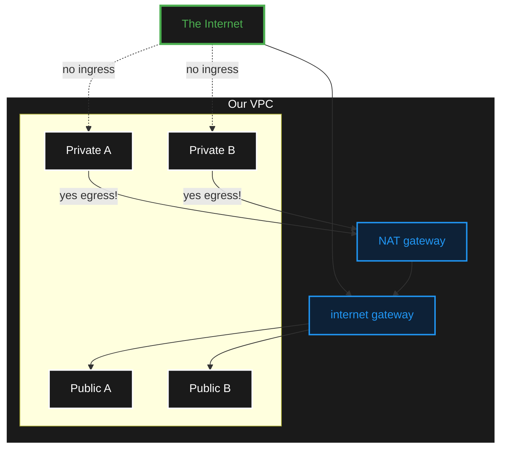

# VPC Network Diagram

Following the course we created the following AWS objects under VPC:

- A VPC named patientping
- 4 subnets:
  - patientping-public-a
  - patientping-public-b
  - patientping-private-a
  - patientping-private-b
- 2 route tables:
  - patientping-public-rt
  - patientping-private-rt
- 1 internet gateway patientpint-igw

This is an AI generated diagram of the components:

## Diagram Explanation

This diagram illustrates a typical AWS VPC network topology with the following characteristics:

- **The Internet**: External network access represented at the top.
- **Our VPC**: The Virtual Private Cloud boundary containing all resources.
- **Private Subnets (A & B)**: Resources here have **no direct inbound access** from the internet (no ingress). However, they **can initiate outbound connections** (egress) through the NAT gateway.
- **Public Subnets (A & B)**: Resources here can communicate directly with the internet via the Internet Gateway.
- **Internet Gateway**: Allows bidirectional communication between public subnets and the internet.
- **NAT Gateway**: Allows private subnets to initiate outbound connections to the internet while remaining protected from unsolicited inbound traffic.

## References

- [Virtual Private Cloud](!https://docs.aws.amazon.com/vpc/latest/userguide/what-is-amazon-vpc.html)
- [Classless Inter-Domain Routing (CIDR)](!https://aws.amazon.com/what-is/cidr/)
- [Internet Gateway](!https://docs.aws.amazon.com/vpc/latest/userguide/VPC_Internet_Gateway.html)
- [Route Table](!https://docs.aws.amazon.com/vpc/latest/userguide/RouteTables.html)
